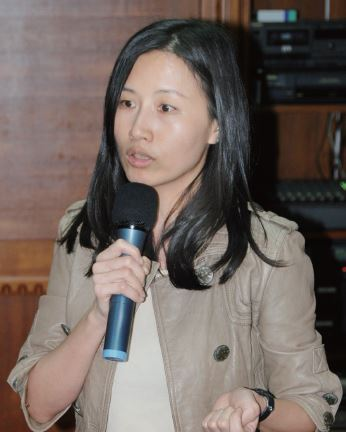

# 找到最適合自己的角色並努力做好，在這個運動中，每一個人都至關重要

##### 陳孟秀律師，反服貿黑箱義務律師團成員

本身長期參與樂生療養院的案件，因此對社運案件並不陌生，也累積了不少陪偵經驗。318學運發生後，和身邊的律師朋友一起響應司改會的號召，加入了義務律師團的行列。

加入後歷經了324行政院的暴力驅離，雖然以往的經驗告訴我會有這樣的場面發生，但發生時還是感到十分心痛及悲傷，尤其是訪談了其中一位受傷的學生後。

當時我接到通知，匆匆地從行政院現場趕到馬偕醫院，協助一位受傷的同學。在見到學生的當下，他的眼中充滿了驚嚇和恐懼，甚至在我表明身分後，仍然對我有所防備。在與這位學生多次的電話連繫中，才知道在事件後沒多久警察已經找上門了。每當我在電話中提到控訴國家暴力的事，他就會掛斷電話，再打給他，他依舊會接，但再提到相關的事，還是會掛斷。我想，這位學生對自己行為的是非判斷，也許已經因為警方的騷擾而動搖、混淆。這件事會是他心中永遠難以抹去的傷痛，甚至之後對其他遊行活動都可能因恐懼而抱持冷漠的態度了。看到他的狀況，我更加深刻的感受到學生受國家脅迫的壓力和恐懼，更堅定了我對控訴國家暴力的想法。

參與樂生訴訟及陪偵的經驗，我深刻體會到國家機器的可怕和龐大，尤其是一個人必須隻身對抗這樣龐大的系統和體制，更顯得艱難與無力。一個人，一邊肩負保護運動者的責任，一邊對抗司法的追訴和威脅，有時難免感到力不從心，甚至也曾經很掙扎的想只接一般案件，甚麼都不想管，但卻始終放不下。

對我來說加入律師團是十分特別的經驗，因為司改會，我感覺到這次不一樣了。司改會義無反顧的跳出來組織律師團，而身旁許多以往較少實際投入公益案件的律師也紛紛加入，讓我驚訝又激動，覺得自己不再孤立無援，有一大群志同道合的夥伴。

控訴國家暴力是條漫漫長路，而司改會是律師們能堅持下去的重要力量。除了讓律師脫離單打獨鬥的辛苦狀態，司改會的組織更讓資源能有效的分配，並做到最充分的利用，也讓想貢獻一份心力的律師在運動中找到適合自己的位置，發揮所長。

而對於這場運動，我一直認為我所做的事和在街上靜坐的群眾並沒有甚麼不同。我們都只是找到一個最適合自己的角色，並努力做好能做的而已。在這個運動中，每一個人都至關重要。

