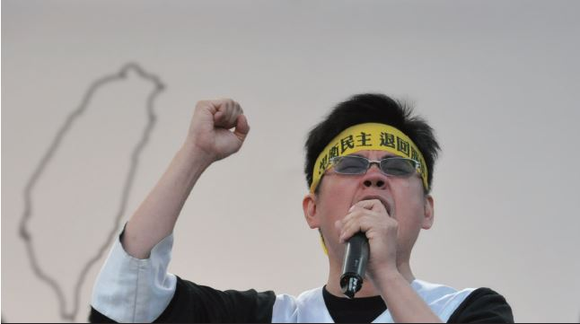

# 義務律師不要錢，要的是更深刻的許諾

##### 丁穩勝律師，反服貿黑箱義務律師團成員

2014 年 3 月 18 日，是台灣民主發展歷程的重要里程碑，學生佔領立院、誓言阻擋黑箱服貿的決心和行動，就像直竄夜空的一枚煙火，猛然爆出巨大聲響，剎那綻放出絢爛火花。3 月 30 日，50 萬人凱道遊行，在許多人的生命中留下深刻記憶，然而，一場盛大遊行的結束，並不代表人民已經得到渴望的公理正義，直到現在，超越憲法的國家暴力沒有受到處分，多數人反對的政策仍然不時企圖強渡關山，而有多少人到現在依然持續關心？多少人明白對抗國家機器和憲政失靈，並不是幾小時的「假日健走」就能達成。

律師投入公益案件多是對議題有很深的認同，是理念的結合，義務律師不收錢，但不是不求回報，這樣的付出和投入，要的是一種更深刻的許諾，當社會有其他議題需要聲援時，為他人站出來，繼續為正義而戰，將經驗傳承，回饋台灣社會。

站在掌權者的對立面，與惡法及不義對抗，是一件比想像中更艱難的事情，但，法律的更迭，都是用換的：用生命換取，以血汗得來。