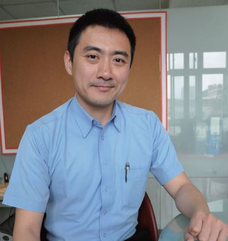
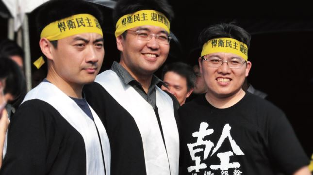

# 當人民為了捍衛民主勇敢前進，站出來保護他們，是我們的義務與責任

##### 李宣毅律師，反服貿黑箱義務律師團組長

318 運動的起因是國家行政與立法機關違背了其憲法上的義務，進而喪失其憲法上的功能，因此學生佔領立法院的訴求，具有公益性與急迫性。

當國家力量違法而傷害民主憲政，而人民為了捍衛民主、勇敢前進時，律師們就應該站出來保護他們，我認為這是身為律師的義務與責任，遑論《律師法》第一條規定律師有義務促進民主法治。與當權者的對抗很困難，但是我不想、也不該讓事情就這樣過去。更何況有這麼多年輕一代的公民，具備渾厚的勇氣跟智慧，指出破壞民主憲政的執政者身穿國王的新衣，我們當然更有義務要加以支持。

學運期間，司改會站出來號召、成立義務律師團。這使有意願幫忙的律師們有可信賴之媒介，迅速、有效地找到需要幫助的公民，司改會作為整合律師的平台，成功地協助律師履行《律師法》第一條要求的義務，這應該是臺灣律師史上，具有里程碑意義的重大機制。

對於在街頭意欲維持民主制度的公民來說，司改會已經具備有強大的公信力，其不但有能量召喚上百位熱血律師抵達第一線，更重要的是，社會大眾因此對其有深切的信賴以及認同。我認為這是因為司改會提供的幫助，確實遠遠超出民眾的預期，現在不論是社會運動或是集會遊行，司改會專線已成為公民在活動現場第一支必需要背起來的電話。

從另一角度觀察，近年因律師名額放寬，使更多不同種類的法律人進入律師市場，其中「非典型」律師不斷增加，致使律師這一個職業在臺灣社會中可以扮演的角色越發活潑。年輕律師需要依自己的特性去發揮、找尋適合自己的市場。

而司改會這個舞台，擁有很多充滿挑戰性的案件，使有志的律師有機會證明自己。司改會協助律師發現自己的可能，也讓律師這個職業的印象在臺灣不斷翻轉。

不只是律師應該找尋自己的可能，年輕人更是。在參與社運與律團的經驗中發現，台灣的年輕人長久以來太小看自己，但這次學運，證明了學生、年輕人本當是社會的核心力量，我們很急切地期盼更多人積極且實質上的加入公民運動，只要你有想法、願意付出，每個人都在司改會、在台灣社會中能找到屬於自己的角色。我們需要大家，請大家千萬不要低估了自己的可能。

