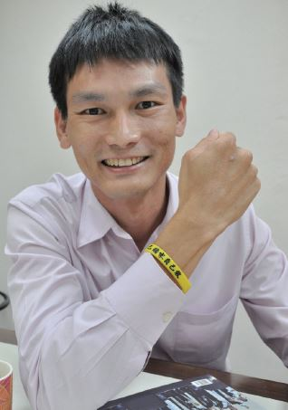

# 律師是司法實務與學術的重要橋梁，將學術新的見解與論述帶入法庭

##### 林育丞律師，反服貿黑箱義務律師團組長

這次服貿會造成這麼大的爭議，起因是執政者處理的過程不透明不完整，特別對象又是政治上長期對台灣有敵意的國家，所有的決定更應該充分被討論。且觀察現在執政者的作為，土地徵收、自經區到服貿議題，可以發現許多政策推動的最大獲益者並非是人民，往往為的是官商自身的利益。並不是說政策完全不能犧牲少數人利益，但若犧牲不是為了成就全民或社會，而是少數即得利益者時，更覺得痛心。

起初對服貿運動沒有特別關注，覺得可能會像過往大部分的社會運動一樣很快的被淹沒消失。沒想到學生成功佔領了立法院，我認為這確實衝破了某種限制跟規定，後續可能會引發一些較大的事件。

當學生可能面臨國家訴追，我認為律師應當出面協助。即使司改會沒有成立律師團，我們事務所也一定會跳出來幫忙。特別是衝入議場裡的多是年輕學生，雖然他們可能有預期會面臨訴訟問題，但也許忽略了後續接踵而至的社會壓力。尤其很多學生是第一次參與街頭運動，在議場排班時有同學擔憂的問「會不會留下案底」。此時需要有人站出來為他們說說話，或是幫忙他們免除面對檢警單位時的不當對待。

司改會過往多以菁英式的法案遊說與倡議，較少草根的去接觸社會大眾，此次的運動是很好的契機，讓更多人認識司改會，司改會經過 318 運動後更有活力了。此外，建議司改會繼續投入法治教育的推廣，特別是中南部地區，除了大學也可向下延伸至高中，教育是公民社會的根基。抗爭現場的衝突前的宣導也可再加強，陪同偵訊時發現，部分同學對於相關的法律權利及責任並無概念，也未先做好對抗體制的心理準備，參與抗爭的民眾應更清楚的了解衝撞體制可能面臨的風險，走上街頭前先經過更慎重的考量。

過去以為律師是被動的角色，不過到這個事務所後看到律師是可以主動出擊的。一般百姓權益被國家侵害時，大多不知如何是好，覺得「民不與官鬥」只能讓事情過去，在許多土地徵收的案件中看到詹順貴律師走入鄉間農村，告訴民眾可以透由司法途徑去爭取，並提供實際的協助。從洪仲丘案及全國關廠工人案也可以看見，律師與社會運動抗爭者站在一起，推動了制度上的變革。

而律師也是司法實務與學術界的重要橋梁，將學術界新的見解與論述帶入法庭，協助法院完成論述。我們難以期待體制內的法官、檢察官主動跳出來，這與他們的角色可能有衝突，例如大法官不會自己跳出來釋憲，而是由律師先提出，再由大法官作出解釋。

所有的社會運動都難免會因時間推移熱情逐漸消退，而義務律師與當事人正因為有訴訟案件，會繼續走下去，但其他更多數的參與者要如何維持，如何使他們持續投入，需要大家共同來努力。
