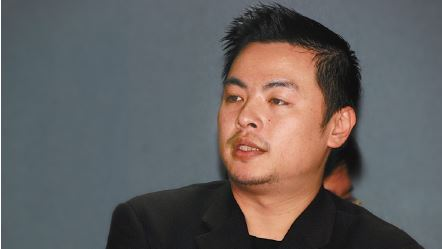

# 太陽花，喚起了參與社會運動的熱情

##### 吳啟豪律師，反服貿黑箱義務律師團組長

學生時期曾參與過司改會的活動，也參與社會運動，但開始執業、開事務所之後因工作繁忙，已經好幾年沒有這麼認真的關心公共議題了。在 318 運動期間，幾乎停下了手邊的工作，兩三天便會去立法院附近走走看看，因平時興趣是攝影，也做了一些現場的影像紀錄，直到最後的退場皆有參與。以前對七、八年級的年輕人有「草莓族」的誤解。在 318 運動中，看到學生成熟的組織、策略及訴求，比過往自己曾參與的街頭運動都更為完善，從學生身上學到很多，令人感動，也喚醒了自己年輕時期參與公共議題的熱情。後來得知顧律師號召義務律師，於是就加入了，並擔任辯護組組長。

330 凱道遊行，和很多律師一起站在台上，難得有機會見到 50 萬民眾在台下，印象很深刻，但同時也意識到隨之而來的虛榮。陳為廷曾說：「千萬不要相信我們不會變質，永遠質疑我們。」在台上時對這句話有很深的感觸，舞台的氛圍可能會使人為討好群眾而忘了初衷，陳為廷這句話中的反思，讓我非常欽佩，更是感動。期望司改會除了行政上的協助之外，能提供公民不服從、抵抗權這部分的法律資源，此部分的概念對於律師是較新且不熟悉的，需要司改會協助律師交流法律上的見解。律師在社會運動中扮演的角色雖然有限，但仍慶幸自己能參與 318 運動，甚至可說若沒有參與會感到非常遺憾，我相信 318 運動在台灣歷史上，是重要且關鍵的。
