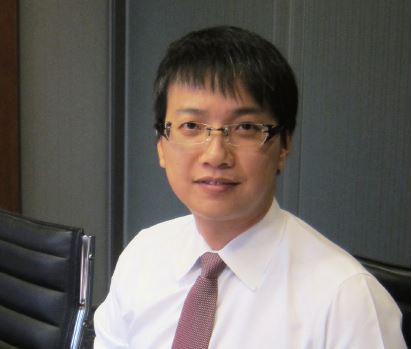

# 身為可以提供力量的一份子，如果我仍袖手旁觀，就是制度的共犯

##### 魏潮宗律師，反服貿黑箱義務律師團組長

在民主國家中，違反正當程序是不能被接受的。從新聞得知服貿黑箱事件後，除了持續關心，也不斷思考該怎麼參與，如何投入最能帶來幫助？透過司改會即時建構的義務律師平台，決定以提供法律專業的角度投入，參與議場排班、進行辯護、324 在保安大隊徹夜陪偵，到現在繼續控訴 324 國家暴力。

司改會建構了一個統整平台，包括人力需求的調度、表達律師團聲音，凡須整合律師們的力量，司改會是不可或缺的角色。

參與以來，印象最深的是 324 驅離現場。警隊以隱藏臂章、戴面罩、群體掩護等方式執行，許多被害人無從辨識與追究施暴者。這是典型群眾運動面臨的狀況。這種執行制度，變相鼓勵員警能夠不顧後果的執法，是「制度」造成的暴力。

服貿黑箱與 318 運動發生前，我仍然很難相信台灣民主發展這麼多年，竟會走到這步。身為可以提供力量的一份子，如果我還是袖手旁觀，就會是這個制度結構的共犯。318 運動再度燃起大眾參與公共事務的熱情。我也期待這份熱情能持續。不管支持或反對議題，把意見表達出來，積極討論、交流與思辨，相信公民們可以更清楚明白自己真正想要的。
