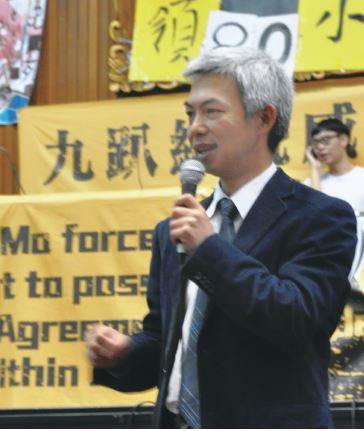
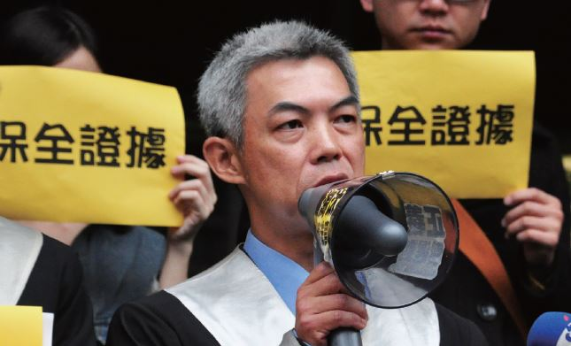

# 有強壯的公民社會，才可能有健全的民主自由

##### 尤伯祥律師，反服貿黑箱義務律師團召集人

近來國家的民主憲政無聲無息地往黨國體制方向前進，特別是在 2013 年年底，國民黨中常會修正黨章總統直接兼任黨主席時，感受特別強烈，相當擔憂。後來發現許多人都有同樣的憂慮。

黑箱服貿引爆了 318 運動，抗爭者佔領立法院後，司改會號召律師，以因應抗爭群眾被逮捕時的緊急陪偵，且可預期「佔領立法院」行動，後續也將面臨許多訴訟。台灣過去從未有如此大規模的佔領運動、抵抗權的行使，我認為佔領運動對於國家民主的發展與保衛是相當重要的，「抵抗權行使」在法律層面的捍衛，需要律師的投入，因而參與 318 反服貿黑箱義務律師團。

323 得知群眾佔領行政院時，就猜測可能會發生國家暴力事件，但沒想到情況遠超出想像，執政者竟然如此為達目的不擇手段。台灣走過美麗島事件 30 多年，相似的場景竟在這個時代再度重演，若不正面面對，去譴責與追究，人民該如何再次站上街頭為民主抗爭？

行政院國家暴力發生後，至今不見檢警單位積極調查，司法機器對國家暴力的沉默與冷漠，我認為是最可怕的。無論是檢警調或法院，過往追究國家暴力責任的記錄，都讓人無法信賴，因為他們自己本身往往就是加害者，因此必須自己站出來提起控訴。

司改會過往在許多救援案件或議題中，有時難免覺得孤單。但此次發出號召律師的訊息後，很快的就有近 300 位律師願意加入緊急陪偵，後續參與控訴國家暴力的律師也相當多，特別其中許多是年輕律師，讓我很驚艷，心裡非常高興感動，我們並不孤單，這是司改會在 318 運動中最大的收獲！

期許司改會能藉由社會運動參與，與更多公民團體連結增加影響力，司法改革需要全體國民推動，不應侷限於法律菁英。有強壯的公民社會，才會有健全的民主與自由，而強壯的公民社會必然會有健全活躍的公民團體存在，才能有效地把公民整合起來，發揮公民創造與監督的力量。司改會也應繼續努力，讓更多人民有自覺的參與公共議題，擴大公民參與的基底。

330 凱道聲援，與義務律師群一同站在舞台上，看到這麼多人為民主挺身，我們必須保護且維持這樣的公民社會活力，民主自由才會真正得到保障。

律師是批判與監督政府的在野法曹。

