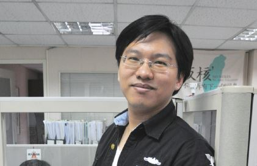

# 文明的社會應尊重並保護多元價值

##### 周宇修律師，反服貿黑箱義務律師團組長

為支援大埔案，我與余宗鳴律師在社群網站上設了社運律師平台，希望可以連結有意願投入的律師，提供即時的法律資源。承繼設立社團平台的初衷，於是加入司改會號召的義務律師團。

318 運動以來，司改會擔負龐大的行政工作，光是過濾當事人的訊息就佔用不少行政資源。律團的律師也不一定理念一致，如何居中協調，以及要以什麼型態、程度整合，都需要透過司改會從中組織，如果沒有行政平台存在，律師團是建立不起來的。

以前社會大眾對律師的想法可能只侷限於上法庭打官司，近來許多社會運動的律師參與，律師可以用專業去幫助或影響社會議題，發現律師更多的可能性。其實不僅是律師，醫師、護理師、資訊工程師更多的專業工作者，也在公共議題中用自身的專業去參與，打開了「只在自己的專業場域工作」這過於狹隘的想法。

今年對我而言意義非凡，我的女兒在五月出生了，她是一位早產兒，看著這個生命努力的想要成長，感觸很多。當社會逐漸邁向文明，我們追求每個人都能在平等的環境中茁壯。若是在過去資源不足的社會裡，她可能難以生存，但現在有許多社會資源支持著她。因此反饋回來去思考其他的情形，除了身體上的照護，在價值、思想上的也應該得到一樣的尊重跟保護。

同時也想藉這個機會告訴有相同理念的夥伴，能夠與志同道合的人一起努力，成為彼此的力量，是一件幸福的事。
