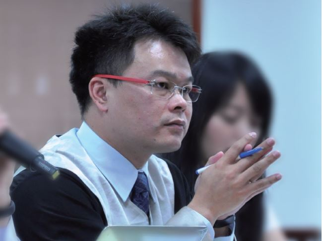

# 參與公益案件是律師生涯的一部份

##### 林俊宏律師，反服貿黑箱義務律師團組長

318 運動發生時我剛從國外回來，從新聞得知學生佔領立法院議場。深入了解學生發起抗爭的原因與訴求後，覺得政府的行為非常誇張，同一時間得知顧律師在召集義務律師團所以加入。

學運期間司改會負責組織串連律師，扮演訊息傳遞與溝通的角色。義務律師平台成立至今運作起來很順暢，也因為司改會參與的程度與過程使社會大眾更了解司改會這個組織，也更清楚司改會如何運作，對民眾認識司改會是有提升的。

我認為參與公益案件是從事法律工作者，本身就會去做的事，對我來說是律師生涯的一部份。我期待義務律師團能長久的維繫下去，但是隨著時間的過去有些律師會漸漸淡出，所以我們應該找出使所有律師都有參與感的運作模式。大家加油！

