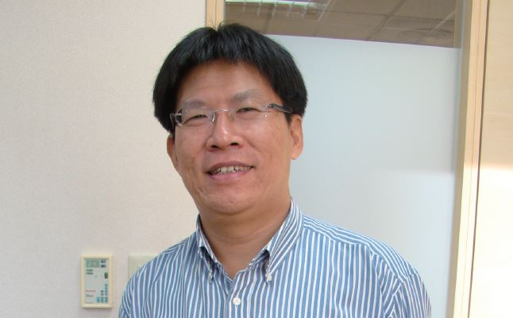

# 種下種子，總會等到開花結果的一天

##### 高涌誠律師，反服貿黑箱義務律師團召集人

我想野草莓學運可說是司改會義務律師團與後續社會運動的啟蒙吧！政黨輪替後，因為轉型正義不夠徹底，威權幽靈始終存在於執政者的施政中，依法行政成為侵害人民權利的最佳藉口。以往年輕律師對於參與社運的陪偵、辯護等法律工作熱度不高，但野草莓學運讓他們發現威權的幽靈的確回來了，台灣的民主不能再倒退。野草莓的訴求主要針對集會遊行法，而集遊法也是司改會聲援重點，於是衍生出了我控訴系列。我控訴系列也成為司改會開始統整司法資源、召募義務律師、協助社會運動的起源。

後來的大埔拆遷、文林苑都更、華光社區迫遷，更顯示國家行政機器的暴走，也使群眾運動的次數及對抗性節節升高，開始有年輕律師集結關注社會運動，認為當人民基本權利受到國家打壓時，身為律師的我們有義務站出來維權，幫人民捍衛權利，爾後更成立社運律師平台，奠定義務律師團的雛型。

司改會長期與社運團體合作互助，也因著社會大眾的期待與我們的自我期許，司改會必然接下組織律師團的角色與任務，隨著運動的發展，「25231178」司改會專線的出現，更因應運動即時的需求，司改會義務律師團和專線提供抗爭群眾協助的印象漸漸深植人心。

在 323 發生國家暴力後，社會大眾對律師角色的想法產生改變。記得期間我與顧律師去台北市議會參加「記者、醫生、律師，在群眾運動現場角色」的協調會，從議員把這三種專業人士放在一起討論的角度來看，看得出社會大眾將本是負責後端支援的律師角色往前拉了，我認為律師若能在第一線做好協調緩衝，雙方衝突與紛爭也許會大量減少，這是律師很大的角色轉變。

一直以來我持續參與公共議題，但是早期對於部分律師是失望的，因為《律師法》第一條這樣規定，但為什麼明明是正確的、正義的改革運動他們卻不願意參與聲援？野草莓學運是一次啟蒙，我發現其實所有事物都是潛移默化的，種下種子總能等到開花結果的一天，318 運動期間，從年輕律師身上看到念法律的熱血與初衷，也看見當初種下的種子開始發芽茁壯。

隨著時間過去，世代交替開始出現，這是個好的現象，我們需要開始培養新的接班人，將手中的資源轉移，必須栽培、澆水使他們茁壯，這是我們現階段的任務也是我認為最重要的事。台灣的未來在這一群年輕律師的手裡，能在他們身上看到 20 年前我們的那種熱情是非常令人興奮的。「公民覺醒」這四個字我認為是對這次 318 運動最好的形容，經過這次，台灣的學生已經意識到社會議題與自己有密切的關連，自已的國家自己救，我們應該都要挺身聲援。
