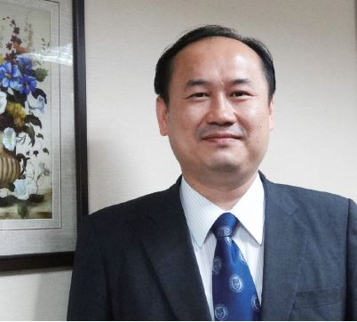

# 期待年輕律師血液中的正義感終生存續

##### 許惠峰律師，反服貿黑箱義務律師團召集人

參與 318 律師團的初衷很簡單，本身是文化大學法律系系主任，從教育的立場，年輕人有理想、關心國家社會，我們應該支持與鼓勵。有些人以為年輕人是失落的一代，但我認為這個「失落」是國家制度對不起他們，包括薪資倒退、房價高漲，讓他們看起來沒有希望。我非常支持年輕朋友說「自己的國家自己救」，而我們這輩應該要幫助他們，成為後盾。

任何的社會運動都需要一個 keyperson 或團隊作整體協調的工作，否則只是一盤散沙，司改會的角色就是作一個組織平台，在背後協調、分配工作及資訊的交換。許多社會案件、議題會聯繫司改會，而非直接找律師，義務律師平台若能變成常態，至少是一個 database。由平台發出訊息，詢問是否有律師願意協助，司改會在人力及各方面的負擔將能減少，也可以讓年輕律師參與，那這個義務律師平台就具備價值。

318 運動有許多年輕律師願意站出來，實在令人欣慰。一般人可能覺得律師唯利是圖，但在 330 遊行時，由群眾對律師的鼓勵可以發現，社會對律師伸張正義的角色仍有所期待。透過這次 318 運動律師的參與，突顯了「律師本該主持正義」的特質。

期望年輕的律師經過 318 運動後，血液裡的正義感，能一直存續，不只在年輕時擁有，而要一直保持下去，終生奉行，如此，律師執業生涯必能無憾。
