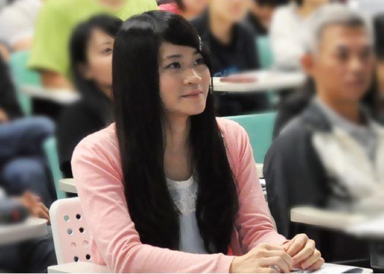

# 一群人，在黑暗中奮力維持一盞光明，期待更多的人感受到這份熱度

##### 林依雯律師，反服貿黑箱義務律師團成員

在 318 運動期間一開始是跟同學撰寫法律面的論述；籌組國內外的發聲平台、投書外媒等。後來接觸到更多在公益訴訟領域耕耘的律師，才發現就算自己實務經驗不足，在對抗國家暴力上仍有發揮所學的空間。目前主要協助控訴，做訴訟上策略和主張的研究。許宗力老師曾經說過：「因為法律學科具有規範性格，法律人在學校學到的都是自由、民主、法治等現代憲政主義議題時，若看到現狀和所學不一致，自然會產生很大的焦慮感，汲汲努力於把現狀拉到和他所學的應然面相符合。」我之所以參與，或許就是因為那樣的焦慮感吧。

過程中大家協力完成一件事。比如說訴訟主張上，常引用國外法院的判決和學術見解，需要很多人來翻譯；還有訴訟上的證據影像，也需要很多人耐心過濾幾百片光碟，這些都是很重要的訴訟材料，我想，沒有他們，整個團隊無法運作的如此順暢。

當初在參與義務律師團時，最大的焦慮就是缺乏實務經驗。但司改會建構了一個資源分享的平台，不但每個人可以依自己的情況找到合適的施力點，也讓律師們能找到行動的夥伴。

就我的觀察，很多律師除了 318 案件，還參加了其他的公益訴訟案件，如果人力和資源許可，司改會可以嘗試擴大組織範疇。公益案件性質、爭點各有不同，平台的擴大不但有助於資訊的交流，也能在人力上互相支援。另外，在參與律團的過程，因為有資深律師的引領，讓我在訴狀的撰寫、訴訟策略的規劃增加不少經驗。對年輕律師來說是很重要的成長歷程，透過這個平台，這些經驗將會發散，未來在公益訴訟上能有更多人站出來。

原本以為律師在社運中只能擔任比較被動的辯護人角色，能做的事情是限縮的。但在 324 那一天，有很多律師在鎮壓現場試著在第一時間嚇阻違法的公權力，應該可視為律師角色轉變的一個跡象，好像遙遠的、冰冷的法律，終於和現實搭上線。

現今台灣社會這麼多的抗爭事件，行動者除了要面對現場直接的國家暴力，很大的一個隱憂是行動後面臨的法律追訴，國家如影隨形的暴力，許多潛在的社會運動參與者將因此卻步。律師除了在控訴上給予協助外，也能保障運動者在受到追訴時應有的權利。

律師能做些什麼，我認為沒有絕對的答案，可以隨著時代演進而發現。或許司改會義務律師團的存在，就是其中一個答案。一群人，在黑暗中奮力地維持一盞光明，期待在接下來的日子裡，有更多的人能感受到這份熱度，貢獻己身所長，並作為學術與實務間溝通的橋樑，也讓社會的應然與實然面更能契合。

