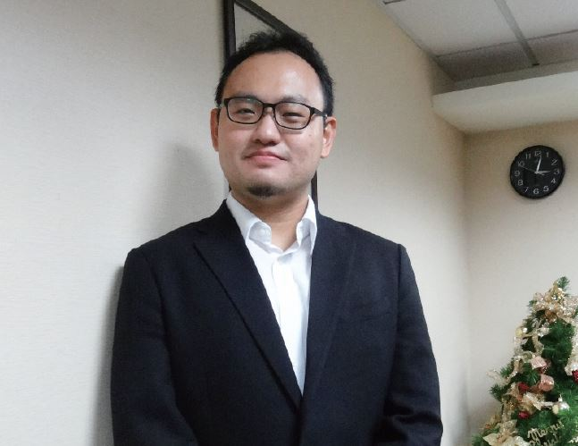
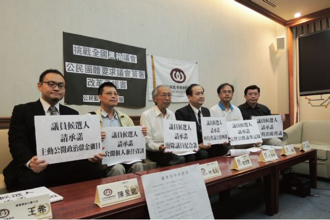

# 為不合理的事勇敢挺身，繼續堅持，作出應有的態度

##### 陳昱龍律師，反服貿黑箱義務律師團成員

反服貿運動期間，人剛好在台南旅行無法趕回台北，從電視上得知時，覺得既生氣又難過。行政院驅離那晚，在旅館思考自己是不是能做些什麼，回來台北後，因為之前在法扶認識一些司改會的朋友，得知司改會正在號召律師，為了實現對自己的諾言，於是加入義務律師團。

由於三月多時我仍是實習律師，而許惠峰律師是控訴及辯護組的組長，所以我幫忙許律師居中協調各個律師的工作分配，在控訴國家暴力的案件上，負責聯絡律師們，並協助寫訴狀。

與一位 323 當事人接觸的經驗讓我印象深刻。她是一位年紀稍長的婦人，到事務所時，起初談話情緒都很平和，但一聊到案情時，她在我面前全身發抖並開始哭泣。她給我們看受傷的照片，照片中的她全身是血，衣服、絲巾全是血跡。談話結束時，她說可以給我們背部受傷的照片，但正面的照片是否能不提供給司改會或訴諸媒體，她深怕遭受國家的二次報復。這一幕讓我很震撼，人民已經遭受國家不公平的對待，卻必須顧慮可能會被國家再次傷害，這種心情讓我感到憤恨與不捨。

若沒有司改會這個平台，律師們如同一盤散沙，無法凝聚力量，司改會協助律師團開會、聯絡各個律師，給予行政上的各方協助。希望義務律師平台能持續凝聚，不因運動的結束而消逝，雖然在現實上實屬困難，但希冀對社會公益及國家有期許的律師能聚在一起奮鬥。

當遇到不合理的事情時，應當勇敢站出來，雖然其中會遭遇莫大挫折，感到心灰意冷，可是與被害人的傷害相比，根本無法比擬，因此要繼續堅持，作出應有的態度。

