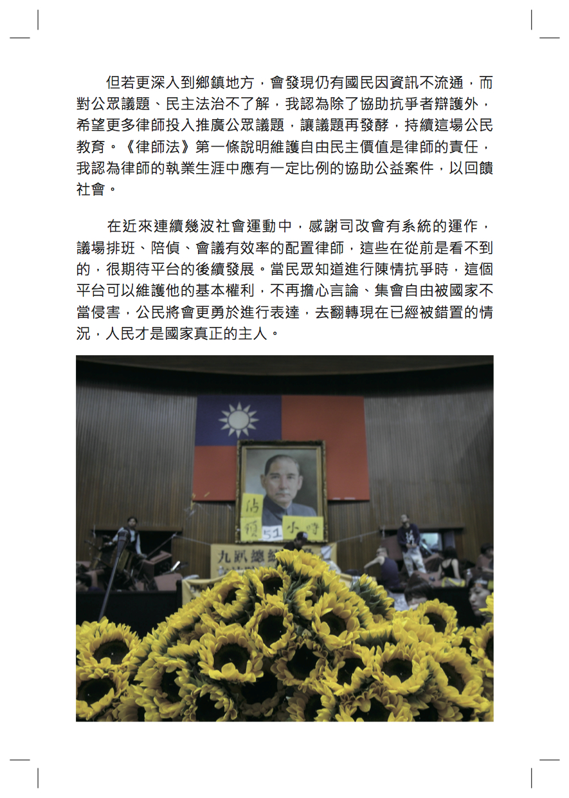

# 戰鬥！直到國家真正把人民當主人

##### 郭德田律師，反服貿黑箱義務律師團成員

這個時代我們面對重大的憲政危機，雖然可以直選總統，可以投票選出立法委員，但我們的政黨對於民主的概念與操作，與人民的想像與期待有明顯不同。民主社會中政黨應該要反映人民聲音，尊重憲法管束使憲政體制運作順暢。但我們的國家元首一手掌握行政權與立法權，權力無法被制衡，本來預設的民主國家，實質上卻出現了一些專制的跡象。

在面臨服貿協議審查的重大時刻，看不到國家認真的與人民進行討論，立法委員也未秉持良心、正當程序進行審查，反而遵循黨意黑箱通過，完全不符合人民對民主政治價值的期待。當年輕人站出來號召公民不服從運動，身為律師的我們應當站在維護民主憲政的角色進行協助，為公民辯護。當有人願意站出來對抗實質專制時，政府會有所畏懼，我認為這次運動只是開始，公民意識開始抬頭，演變成全國性的公民運動。

但若更深入到鄉鎮地方，會發現仍有國民因資訊不流通，而對公眾議題、民主法治不了解，我認為除了協助抗爭者辯護外，希望更多律師投入推廣公眾議題，讓議題再發酵，持續這場公民教育。《律師法》第一條說明維護自由民主價值是律師的責任，我認為律師的執業生涯中應有一定比例的協助公益案件，以回饋社會。

在近來連續幾波社會運動中，感謝司改會有系統的運作，議場排班、陪偵、會議有效率的配置律師，這些在從前是看不到的，很期待平台的後續發展。當民眾知道進行陳情抗爭時，這個平台可以維護他的基本權利，不再擔心言論、集會自由被國家不當侵害，公民將會更勇於進行表達，去翻轉現在已經被錯置的情況，人民才是國家真正的主人。

